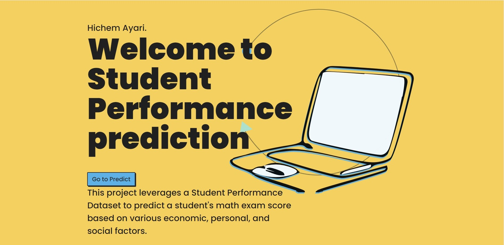

<a id="readme-top"></a>


[![Contributors][contributors-shield]][contributors-url]
[![Forks][forks-shield]][forks-url]
[![Stargazers][stars-shield]][stars-url]
[![Issues][issues-shield]][issues-url]
[![MIT License][license-shield]][license-url]
[![LinkedIn][linkedin-shield]][linkedin-url]


<!-- PROJECT LOGO -->
<br />
<div align="center">
  <a href="https://github.com/othneildrew/Best-README-Template">
    
  </a>

  <h3 align="center">Student Performance Project</h3>

This project leverages a Student Performance Dataset to predict a student's math exam score based on various economic, personal, and social factors. The model achieves an accuracy(r2 score) of 89%.
    <br />
    <br />
    <br />
    <a href="https://github.com/othneildrew/Best-README-Template">View Demo</a>
    ·
    <a href="https://github.com/othneildrew/Best-README-Template/issues/new?labels=bug&template=bug-report---.md">Report Bug</a>
    ·
    <a href="https://github.com/othneildrew/Best-README-Template/issues/new?labels=enhancement&template=feature-request---.md">Request Feature</a>
  </p>
</div>


<!-- TABLE OF CONTENTS -->
<details>
    <summary>Table of Contents</summary>
    <ol>
        <li>
            <a href="#about-the-project">About The Project</a>
            <ul>
                <li><a href="#built-with">Built With</a></li>
            </ul>
        </li>
        <li>
            <a href="#getting-started">Getting Started</a>
            <ul>
                <li><a href="#prerequisites">Prerequisites</a></li>
                <li><a href="#installation">Installation</a></li>
            </ul>
        </li>
        <li><a href="#usage">Usage</a></li>
        <li><a href="#contributing">Contributing</a></li>
        <li><a href="#license">License</a></li>
        <li><a href="#contact">Contact</a></li>
        <li><a href="#what-you-will-learn">What You Will Learn</a></li>
        <ul>
            <li><a href="#data-preprocessing">Data Preprocessing</a></li>
            <li><a href="#exploratory-data-analysis-eda">Exploratory Data Analysis (EDA)</a></li>
            <li><a href="#machine-learning">Machine Learning</a></li>
            <li><a href="#advanced-machine-learning-techniques">Advanced Machine Learning Techniques</a></li>
            <li><a href="#model-deployment">Model Deployment</a></li>
            <li><a href="#version-control-and-collaboration">Version Control and Collaboration</a></li>
            <li><a href="#best-practices">Best Practices</a></li>
            <li><a href="#cloud-deployment">Cloud Deployment</a></li>
            <ul>
                <li><a href="#deploying-the-project-using-aws-elastic-beanstalk">Deploying the Project Using AWS Elastic Beanstalk</a></li>
                <li><a href="#deploying-the-project-using-aws-ec2-and-ecr">Deploying the Project Using AWS EC2 and ECR</a></li>
                <li><a href="#deploying-the-project-using-azure-container-instances">Deploying the Project Using Azure Container Instances</a></li>
            </ul>
        </ul>
    </ol>
</details>


<!-- ABOUT THE PROJECT -->
## About The Project

[![Product Name Screen Shot][product-screenshot]](https://example.com)

This project aims to predict a student's math exam score using a dataset that includes various economic, personal, and social factors. By leveraging machine learning techniques, we hope to identify key indicators that influence academic performance and provide insights that can help educators and policymakers improve student outcomes.

Here's why this project is important:
* It focuses on creating a meaningful impact by addressing educational challenges.
* It utilizes data-driven approaches to uncover hidden patterns and correlations.
* It aims to provide actionable insights that can be implemented in real-world educational settings.

Feel free to explore the project, contribute, or suggest improvements. Your feedback and contributions are highly appreciated!

<p align="right">(<a href="#readme-top">back to top</a>)</p>


### Built With
This project was built using the following major frameworks and libraries:

* 
* 
* 
* 
* 
* 
* 
* 
* 
* 
<p align="right">(<a href="#readme-top">back to top</a>)</p>


<!-- GETTING STARTED -->
## Getting Started

Follow these instructions to set up the project locally.

### Prerequisites

Ensure you have the following installed:
* Python 3.x
* pip (Python package installer)

### Installation

1. Clone the repository:
    ```sh
    git clone https://github.com/hichem-18/mlProjet.git
    ```
2. Navigate to the project directory:
    ```sh
    cd mlproject
    ```
3. Create a virtual environment:
    ```sh
    python -m venv venv
    ```
4. Activate the virtual environment:
    - On Windows:
      ```sh
      venv\Scripts\activate
      ```
    - On macOS/Linux:
      ```sh
      source venv/bin/activate
      ```
5. Install the required packages:
    ```sh
    pip install -r requirements.txt
    ```
6. Run the application:
    ```sh
    python app.py
    ```

<p align="right">(<a href="#readme-top">back to top</a>)</p>


<!-- USAGE EXAMPLES -->
## Usage
### Example Usage

1. **Home Page**: Start by navigating to the home page of the application. You will see a welcome message and a button to proceed to the prediction form.
    

2. **Prediction Form**: Click on the "Go to Predict" button to access the prediction form. Here, you can input various economic, personal, and social factors.
    

3. **Prediction Result**: After filling out the form and submitting it, you will see the predicted math score.
    

<p align="right">(<a href="#readme-top">back to top</a>)</p>


<!-- CONTRIBUTING -->
## Contributing

Contributions are what make the open source community such an amazing place to learn, inspire, and create. Any contributions you make are **greatly appreciated**.

If you have a suggestion that would make this project better, please fork the repo and create a pull request. You can also simply open an issue with the tag "enhancement". Don't forget to give the project a star! Thanks again!

To contribute:

1. Fork the Project
2. Create your Feature Branch (`git checkout -b feature/AmazingFeature`)
3. Commit your Changes (`git commit -m 'Add some AmazingFeature'`)
4. Push to the Branch (`git push origin feature/AmazingFeature`)
5. Open a Pull Request

<p align="right">(<a href="#readme-top">back to top</a>)</p>

### Top contributors:
There are no contributors yet.

<p align="right">(<a href="#readme-top">back to top</a>)</p>


<!-- LICENSE -->
## License

Distributed under the MIT License. See `LICENSE.txt` for more information.

<p align="right">(<a href="#readme-top">back to top</a>)</p>


<!-- CONTACT -->
## Contact

Hichem Ayari - [LinkedIn](https://www.linkedin.com/in/hichem-ayari/) - ayari.hicham01@gmail.com

Project Link: [https://github.com/hichem-18/mlProjet](https://github.com/hichem-18/mlProjet)

<p align="right">(<a href="#readme-top">back to top</a>)</p>

## What You Will Learn

By working on this project, you will gain hands-on experience with the following technical skills and concepts:

### Data Preprocessing
- Handling missing values and outliers
- Encoding categorical variables
- Feature scaling and normalization

### Exploratory Data Analysis (EDA)
- Visualizing data distributions and relationships using Seaborn and Matplotlib
- Identifying key features and correlations

### Machine Learning
- Implementing regression models using Scikit-Learn
- Hyperparameter tuning with GridSearchCV
- Evaluating model performance with metrics such as RMSE and R²

### Advanced Machine Learning Techniques
- Utilizing ensemble methods like XGBoost and CatBoost
- Understanding feature importance and model interpretability

### Model Deployment
- Building a RESTful API with Flask
- Serving the machine learning model through the API
- Creating a simple web interface using HTML and CSS

### Version Control and Collaboration
- Using Git for version control
- Collaborating with others through GitHub

### Best Practices
- Writing clean and maintainable code
- Documenting your code and project effectively

### Cloud Deployment

#### Deploying the Project Using AWS Elastic Beanstalk
- Create an Elastic Beanstalk application in the AWS Management Console.
- Configure the environment and upload your application code.
- Deploy the application and monitor its health and logs.

#### Deploying the Project Using AWS EC2 and ECR
- Build a Docker image of your application.
- Push the Docker image to Amazon Elastic Container Registry (ECR).
- Launch an EC2 instance and install Docker.
- Pull the Docker image from ECR and run the container on the EC2 instance.

#### Deploying the Project Using Azure Container Instances
- Build and tag a Docker image of your application.
- Push the Docker image to Azure Container Registry (ACR).
- Create an Azure Container Instance and configure it to use the image from ACR.
- Deploy the container and monitor its status and logs.


<p align="right">(<a href="#readme-top">back to top</a>)</p>


